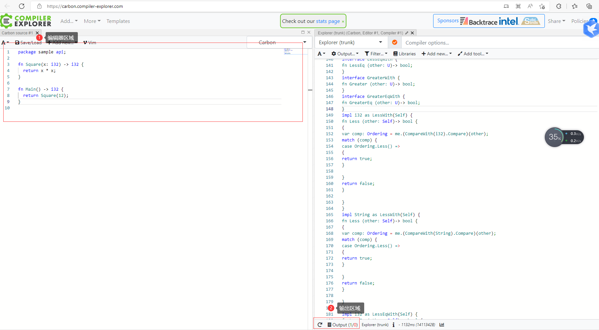
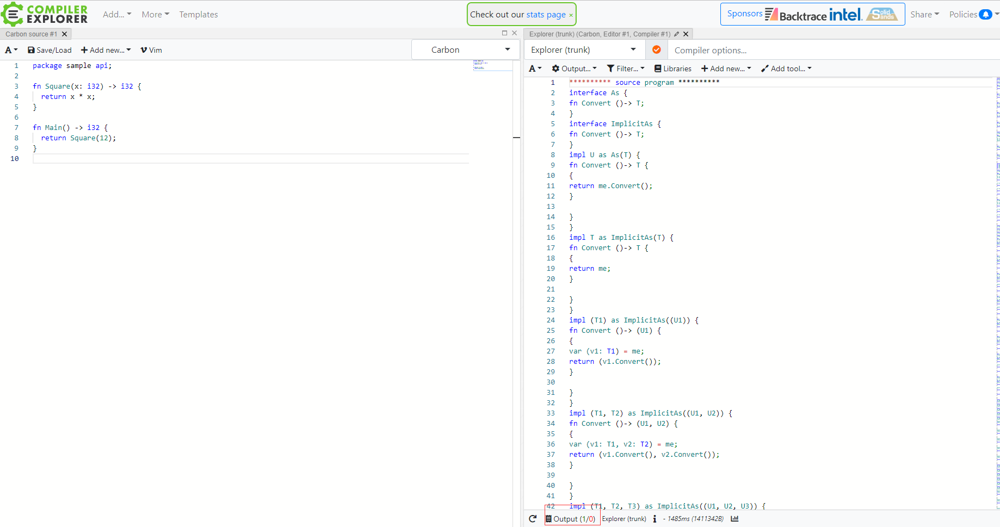
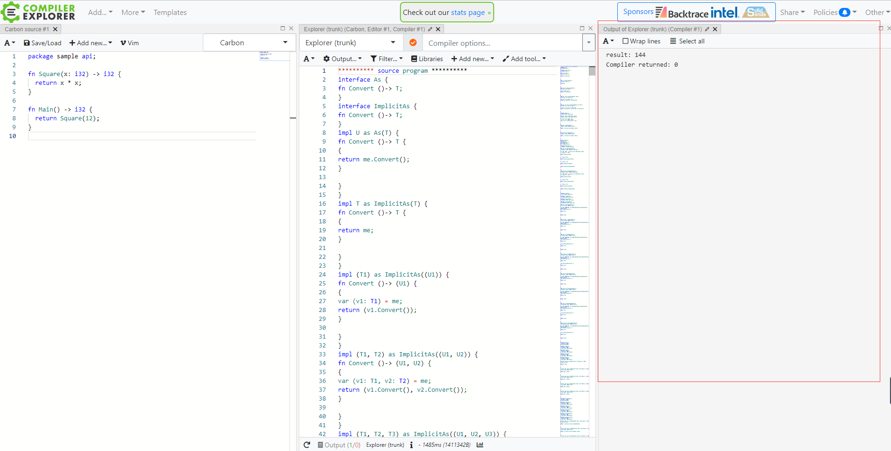
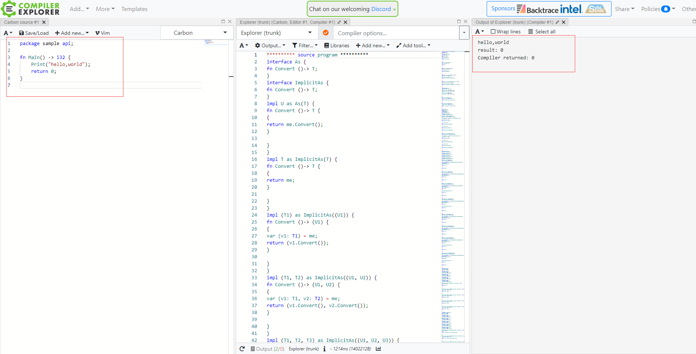

## CH01 - 程序基础结构

## 1.1 环境配置和 hellowrold

### 1 环境配置

由于目前还没有 carbon 的编译器，为了使用Carbon，您可以使用carbon exporer来解释 carbon 代码并打印其输出，您可以立即在[compiler-explorer.com](http://carbon.compiler-explorer.com/)上试用。

你也可以自己创建一个 carbon expore, 通过如下操作步骤：

```shell
# Install bazelisk using Homebrew.
$ brew install bazelisk

# Install Clang/LLVM using Homebrew.
# Many Clang/LLVM releases aren't built with options we rely on.
$ brew install llvm
$ export PATH="$(brew --prefix llvm)/bin:${PATH}"

# Download Carbon's code.
$ git clone https://github.com/carbon-language/carbon-lang
$ cd carbon-lang

# Build and run the explorer.
$ bazel run //explorer -- ./explorer/testdata/print/format_only.carbon
```

### 2 [compiler-exporer.com](http://carbon.compiler-explorer.com/)简单使用

1) 打开[compiler-exporerc.com]([Compiler Explorer (compiler-explorer.com)](https://carbon.compiler-explorer.com/) 可以查看到如下界面：



第一个部分是编辑器区域，你可以在此处编写你的代码；第二个部分是输出区域，可以在此处查看代码的输出。

2）点击output的窗口，即可代码output窗口





3）output窗口位置设置

output窗口的位置是可以拖动的，你可以拖拽到你喜欢的位置

### 3 hello，world

ch01-helloworld.car

```carbon
package sample api;

fn Main() -> i32 {
    Print("hello,world");
    return 0;
}
```

输出的结果:

